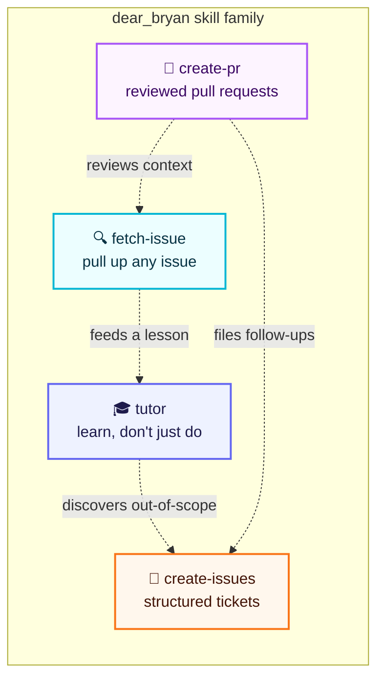
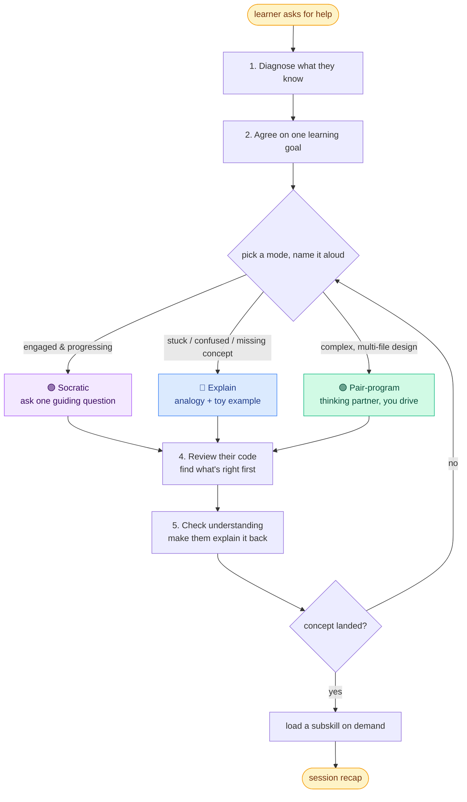
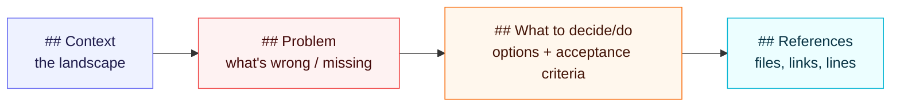
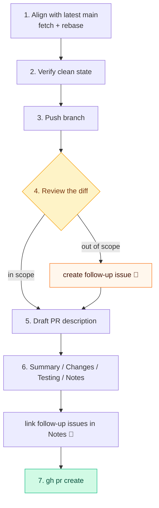
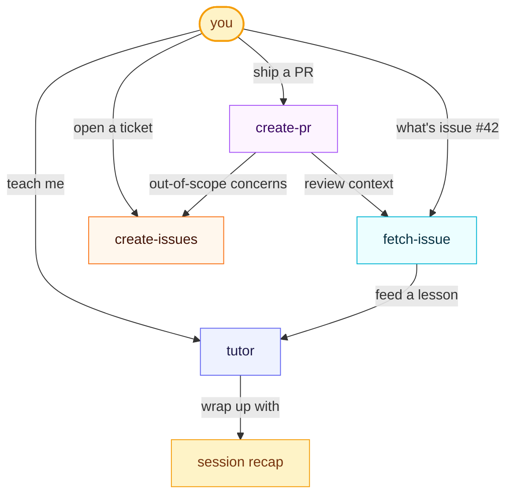

<div align="center">

# 🌟 dear_bryan

### A thoughtfully crafted collection of agent skills — for tutoring, shipping, and keeping the thread.

[](./)
[](https://agentskills.io/specification)
[](./)
[](https://github.com/earendil-works/pi-coding-agent)

*Teach me to fish 🎣 · Ship with structure 📦 · Never lose context 🧵*

</div>

---

## ✨ What's inside

Four skills that make an AI coding agent **teach instead of do**, **ship with structure**, and **keep the thread** across a session.



| Skill | One-liner | Trigger |
|:---|:---|:---|
| **[tutor](./tutor)** | A hybrid adaptive coding tutor — coaches you to write your own code, never writes it for you | `tutor` |
| **[create-issues](./create-issues)** | Structured tickets with Context / Problem / What to decide / References | `create-issues` |
| **[create-pr](./create-pr)** | Review-aware PRs that align with main and file follow-up issues for out-of-scope concerns | `create-pr` |
| **[fetch-issue](./fetch-issue)** | Pull up any GitHub issue by number or URL with full details and comments | `fetch-issue` |

---

## 🚀 Install

These follow the [Agent Skills](https://agentskills.io/specification) standard, so they work in **pi**, **Claude Code**, **OpenAI Codex**, and any compliant harness.

```bash
# install all four into your global skills dir
npx skills install tutor create-issues create-pr fetch-issue

# or clone and link locally
git clone https://github.com/your-org/dear_bryan.git
# then point your harness at this directory
```

<details>
<summary><b>🧪 In pi specifically</b></summary>

```bash
# per-project: skills in .agents/skills/ are auto-discovered
ln -s ~/dear_bryan/tutor .agents/skills/tutor

# or load on demand
pi --skill ~/dear_bryan/tutor

# invoke once installed
/skill:tutor "recursion in Go"
```

Skills register as `/skill:<name>` commands in pi. The `description` in each `SKILL.md` frontmatter is what the agent matches against — only that snippet lives in context until the skill is invoked (progressive disclosure).

</details>

---

## 🧑‍🎓 tutor — the centerpiece

A personal coding tutor with **one rule that overrides everything** and **three modes** it adapts between.

> **The one rule:** *Never write the learner's actual solution for them.*
> Toy examples, skeletons, pseudocode, one-line hints — yes. The answer — never.



### Three formats for diagrams

The tutor teaches with pictures, not just prose — and picks the lightest format that fits:

| Format | Use it for |
|:---|:---|
| **Mermaid** | Static structure — flowcharts, sequence, state, architecture |
| **ASCII** | Quick terminal sketches, Mermaid fallback |
| **HTML / SVG** | Interactive & animated — step-through algorithms, clickable state machines, growing call stacks |

### Subskills (loaded on demand)

The tutor carries three focused reference docs that load via `read` only when triggered — keeping the base skill lean.

| Trigger | Loads | What it does |
|:---|:---|
| concept just landed, learner wants practice | [`references/practice-problems.md`](./tutor/references/practice-problems.md) | Generate a toy-domain exercise, one at a time, solution withheld |
| stuck on a bug or failing test | [`references/debugging.md`](./tutor/references/debugging.md) | Coach the debugging meta-skill (read error → reproduce → bisect → hypothesize) — not the answer |
| session wrapping up | [`references/recap.md`](./tutor/references/recap.md) | Produce a written recap the learner keeps: goal, takeaways, still-shaky, next steps |

<details>
<summary><b>📖 See the anti-patterns it refuses</b></summary>

The tutor holds the line, politely:

- **"Can you just write it for me?"** → "Writing it for you is the one thing that won't help you learn. Let me ask about the part blocking you instead."
- **"Just fix this function."** → "I'll help you fix it yourself. What input breaks it, and what do you expect?"
- **"Give me the solution."** → Reoffers the modes: a hint, a concept explanation, or a pair walk-through where *you* drive.

If the learner explicitly opts out of tutoring, it respects that — says so plainly, switches off, and ships.

</details>

---

## 📝 create-issues

Every issue follows one exact structure so a newcomer can act on it without reading chat history.



**Workflow:** gather context → explore the codebase for concrete refs → draft → review with you → publish via `gh issue create`.

<details>
<summary><b>🧾 Example issue (bug report)</b></summary>

```markdown
## Context
The picking batches list page uses a `TableCardComponent` for bulk actions.
Its delete button always renders when any row is selected.

## Problem
Clicking delete on a print-only workflow triggers a 404 — no `bulk_delete_url`.
Users see a broken button implying functionality that doesn't exist.

Steps to reproduce:
1. Go to picking batches list.
2. Select rows via checkbox.
3. Observe the "Delete selected" button.
4. Click it — 404.

## What to decide/do
- [ ] Add a `bulk_delete_url` prop to `TableCardComponent`.
- [ ] Only render the delete button when the prop is present.
- [ ] Verify existing delete consumers still show it.
- [ ] Add a component test asserting absence when the prop is missing.

## References
- `app/components/table_card_component.rb` — bulk action bar rendering
- Related PR: https://github.com/org/repo/pull/1234
```

</details>

---

## 🔀 create-pr

A PR skill that's **review-aware**: it aligns the branch with latest main, then **scans the diff for out-of-scope concerns and files them as separate issues** so nothing slips through.



**PR body template:** `## Summary` → `## Changes` (bold-keyed bullets) → `## Testing` → `## Notes` (with out-of-scope issue links).

It deliberately hands off to **create-issues** for anything discovered but not in this PR's scope — keeping the PR focused while capturing the debt.

---

## 🔍 fetch-issue

Pulls a GitHub issue by number or URL and displays its full anatomy.

```bash
gh issue view <id> --json title,body,state,labels,assignees,milestone,comments,url,createdAt,updatedAt
```

Presents a scannable summary, resolves `#<number>` references in the body, and offers to fetch related issues too. Great for grounding a lesson in `tutor` or loading context before `create-pr`.

---

<div align="center">

## 🧬 How they fit together



</div>

---

## 📁 Layout

```
dear_bryan/
├── README.md                 ← you are here
├── .gitignore                ← ignores .pi/ runtime state
├── tutor/
│   ├── SKILL.md              ← the core skill (3 modes, diagrams, one rule)
│   └── references/
│       ├── practice-problems.md   ← toy-domain exercises
│       ├── debugging.md           ← debugging meta-skill coaching
│       └── recap.md               ← end-of-session artifact
├── create-issues/
│   └── SKILL.md              ← Context/Problem/Decide/References template
├── create-pr/
│   └── SKILL.md              ← review-aware PRs with follow-up issues
└── fetch-issue/
    └── SKILL.md              ← gh issue view, structured display
```

---

<div align="center">

**Made with care for agents that care back.** 💜

*Each skill is a single `SKILL.md` (plus optional `references/`) following the [Agent Skills](https://agentskills.io/specification) standard — portable across every compliant harness.*

[▲ back to top](#-dear_bryan)

</div>
