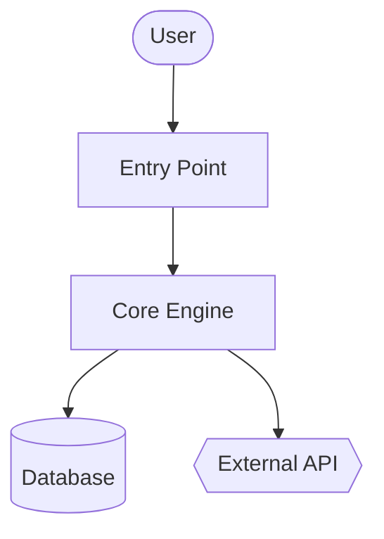
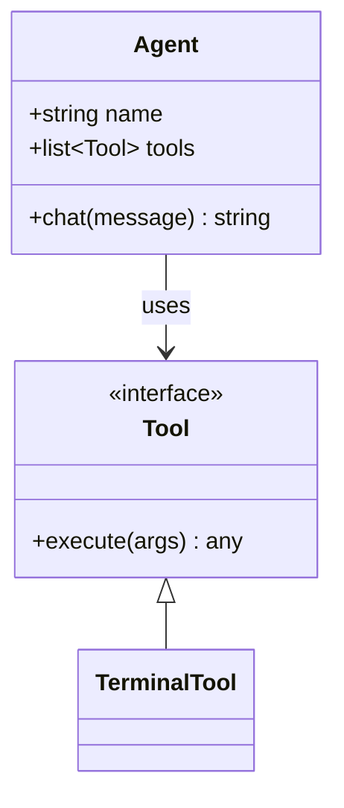
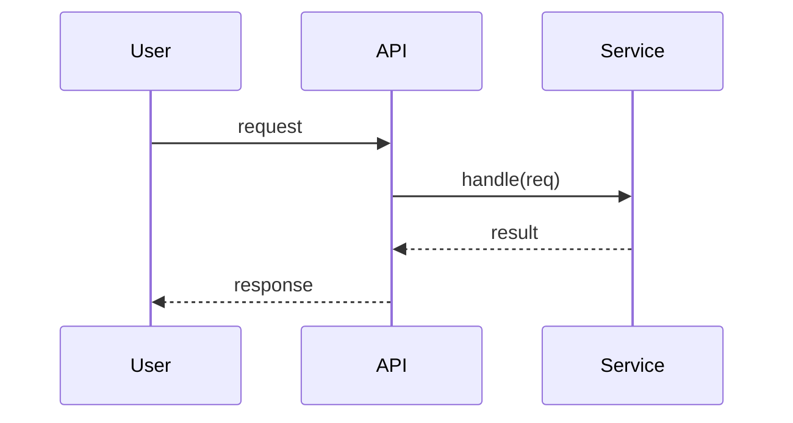

# create-wiki (subskill of gh-workflow)

Load this when the user wants to generate and publish a GitHub Wiki for a repo — "make a wiki", "document this repo on GitHub", "generate architecture docs and push them to the wiki". Produces reference docs (what/how) with Mermaid diagrams and publishes them to the repo's native GitHub Wiki, which renders Mermaid and Markdown automatically.

Inspired by Google CodeWiki / the Hermes `code-wiki` skill, adapted for the GitHub Wiki surface.

## What a GitHub Wiki is

A GitHub Wiki is a **separate git repo** at `https://github.com/<owner>/<repo>.wiki.git`. It is flat (no folders in the rendered nav) and markdown-based:

- `Home.md` — the landing page (required; this is what visitors see first).
- `_Sidebar.md` — optional nav shown on every page.
- `_Footer.md` — optional footer.
- Any other `Page-Name.md` — a page. **Spaces in the filename become hyphens in the URL and vice-versa**: `Getting Started` ⇄ `Getting-Started.md`. Link between pages with `[[Page Name]]` wiki-links or standard `[text](Page-Name)` relative links.

Mermaid fenced blocks (` ```mermaid `) render natively on wiki pages.

## Prerequisites

- `gh` authenticated (`gh auth status`) and `git` on PATH.
- The wiki must be **enabled and initialized**: repo Settings → Features → Wikis, then create at least one page in the browser once. A brand-new wiki with zero pages has no `.wiki.git` to clone yet. Check:

  ```bash
  gh repo view <owner>/<repo> --json hasWikiEnabled -q .hasWikiEnabled
  ```

  If disabled, tell the user to enable it (and create the first page manually) before publishing — you cannot enable it via `gh`.

## Procedure

### 1. Resolve the target repo

- Local cwd (default), a given path, or a URL to `git clone --depth 50 <url>` into a temp dir.
- Capture identity for the state file and wiki remote:

  ```bash
  REPO_SHA=$(git rev-parse HEAD 2>/dev/null || echo "uncommitted")
  REPO_SLUG=$(gh repo view --json nameWithOwner -q .nameWithOwner)   # owner/repo
  ```

### 2. Scan structure

`ls`, `find . -maxdepth 3 -type d`, read manifest files (`package.json`, `Cargo.toml`, `go.mod`, `Gemfile`, `pyproject.toml`), and the existing `README`. Identify entry points, the build/run commands, and the 6–10 most important modules/packages. Don't document everything — pick what a new contributor actually needs.

### 3. Decide the page set

Standard set (skip any that don't apply — YAGNI, don't pad):

| Page | File | Contents |
|---|---|---|
| Home | `Home.md` | One-paragraph what-it-is, the module map (table linking to each page), how to navigate. |
| Architecture | `Architecture.md` | How the pieces fit; a Mermaid `flowchart` of the system. |
| Getting Started | `Getting-Started.md` | Prereqs, install, first run, common workflows — copy real commands from the repo, don't invent them. |
| Per-module pages | `<Module-Name>.md` | One page per key module: responsibility, key files/classes, public API, how it's used, gotchas. |
| Class Diagram | `Class-Diagram.md` | Mermaid `classDiagram` of the core types/relationships. |
| Sequence Diagrams | `Sequence-Diagrams.md` | 2–4 Mermaid `sequenceDiagram`s for the most important flows (request lifecycle, auth, a core job). |
| API | `API.md` | Only if there's a real HTTP/RPC/CLI surface. Otherwise skip. |

Add `_Sidebar.md` linking every page so navigation works.

### 4. Write the pages

Ground every claim in the code — cite real file paths, function names, and commands. If you're unsure how something works, read it; don't guess. Reference docs describe **what and how**, not a "why we chose this" narrative.

Mermaid templates (verify against the actual code, these are shapes not content):







`_Sidebar.md` example:

```markdown
- [Home](Home)
- [Architecture](Architecture)
- [Getting Started](Getting-Started)
- **Modules**
  - [Core](Core)
  - [Storage](Storage)
- [Class Diagram](Class-Diagram)
- [Sequence Diagrams](Sequence-Diagrams)
```

### 5. Review with the user

Show the page list and the Home + Architecture drafts in chat before publishing. Publishing pushes to a public-facing surface — confirm before you push. Iterate until approved.

### 6. Publish to the wiki

Clone the wiki repo, drop the generated pages in, commit, push:

```bash
WIKI_DIR=$(mktemp -d)
git clone "https://github.com/$REPO_SLUG.wiki.git" "$WIKI_DIR"
cp <generated>/*.md "$WIKI_DIR"/
git -C "$WIKI_DIR" add -A
git -C "$WIKI_DIR" commit -m "Generate wiki from $REPO_SLUG@${REPO_SHA:0:7}"
git -C "$WIKI_DIR" push
```

If the clone fails with `repository not found`, the wiki isn't initialized — see Prerequisites (create the first page in the browser once).

### 7. Record state and report

Write `.codewiki-state.json` into the wiki repo so a re-run knows what was generated and against which SHA:

```bash
cat > "$WIKI_DIR/.codewiki-state.json" <<EOF
{
  "repo": "$REPO_SLUG",
  "source_sha": "$REPO_SHA",
  "pages": [ "Home", "Architecture", "Getting-Started" ],
  "generator": "gh-workflow create-wiki"
}
EOF
```
(Commit it in the same push, or a follow-up commit.) Then report the wiki URL to the user: `https://github.com/<owner>/<repo>/wiki`.

## Re-running / updates

On a repeat run, read `.codewiki-state.json` from the wiki repo. Compare `source_sha` to the current HEAD; regenerate only the pages whose modules changed rather than rewriting everything. Keep page filenames stable so URLs and inbound links don't break.

## Rules

- Wiki filenames are flat and hyphen-joined — no subfolders in nav. `Getting Started` → `Getting-Started.md`.
- Never invent commands or APIs. Copy real ones from the repo; if it's not in the code, it doesn't go in the wiki.
- Skip pages that don't apply (no HTTP surface → no `API.md`). Fewer, accurate pages beat a padded set.
- Confirm before the `git push` — the wiki is world-visible on public repos.
